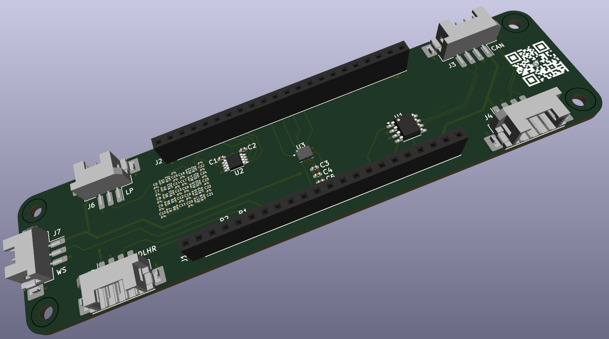
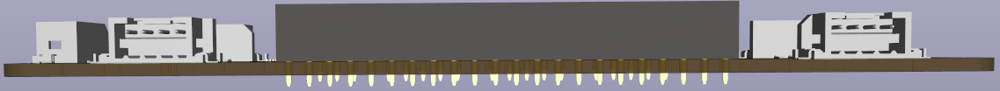

# Suspension-Sensor-System (SSS)
A device that is mounted near each wheel of the car that can record tire temperature and linear potentiometers (suspension travel)

# SSS PCB
Uses Hirose [DF3EA](https://www.digikey.com/en/products/detail/hirose-electric-co-ltd/DF3EA-3P-2H(51)/6148621?utm_adgroup=General&utm_source=google&utm_medium=cpc&utm_campaign=PMax%20Shopping_Product_Zombie%20SKUs&utm_term=&utm_content=General&utm_id=go_cmp-17815035045_adg-_ad-__dev-c_ext-_prd-6148621_sig-Cj0KCQjw1Yy5BhD-ARIsAI0RbXbq7SBVNmAXCWU9K1fzl8auF7Nl_61zIEXugZVVEsHFKjp7xJIr2FsaAh0eEALw_wcB&gad_source=1&gclid=Cj0KCQjw1Yy5BhD-ARIsAI0RbXbq7SBVNmAXCWU9K1fzl8auF7Nl_61zIEXugZVVEsHFKjp7xJIr2FsaAh0eEALw_wcB) connectors w/ right angle headers.

### Schematic

### PCB Drawing

### PCB 3D Model

