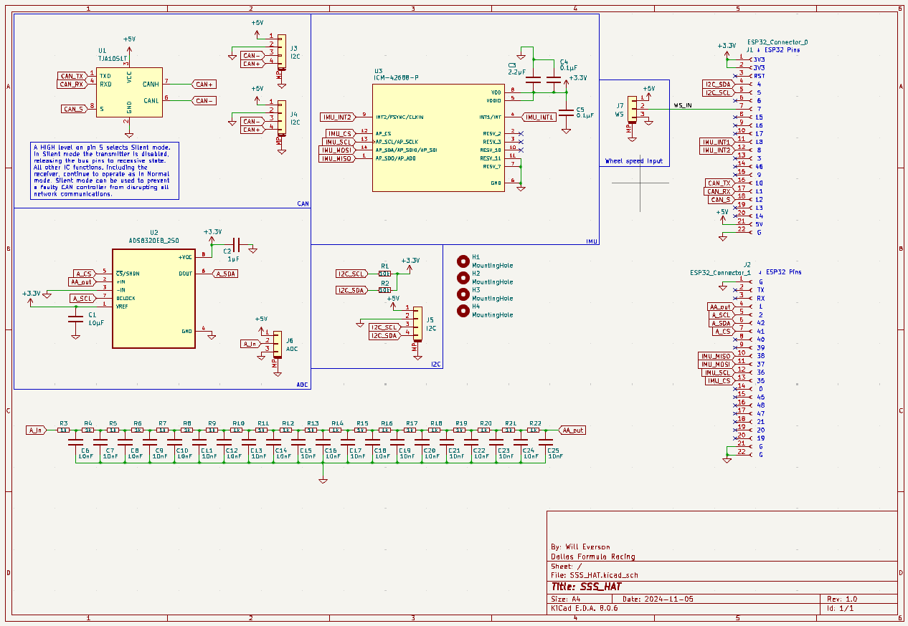
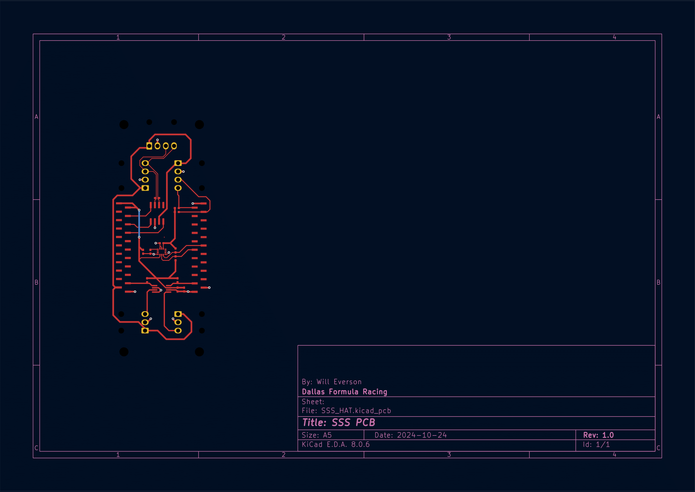
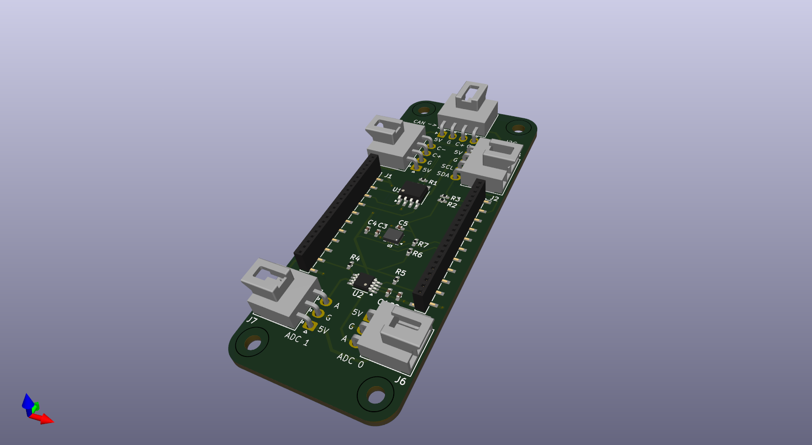

# Suspension-Sensor-System (SSS)
A device that is mounted near each wheel of the car that can record tire temperature and linear potentiometers (suspension travel)

# SSS PCB
Uses Molex [Nano-Fit](https://www.molex.com/en-us/part-list/105313) w/ right angle headers.

### Schematic

### PCB Drawing

### PCB 3D Model

