# Suspension-Sensors (SUS)
A device that is mounted near each wheel of a vehicle that can record tire temperature, acceleration and rotational speed of the vehicle, wheel speed and suspension travel (linear potentiometers).

### Schematic
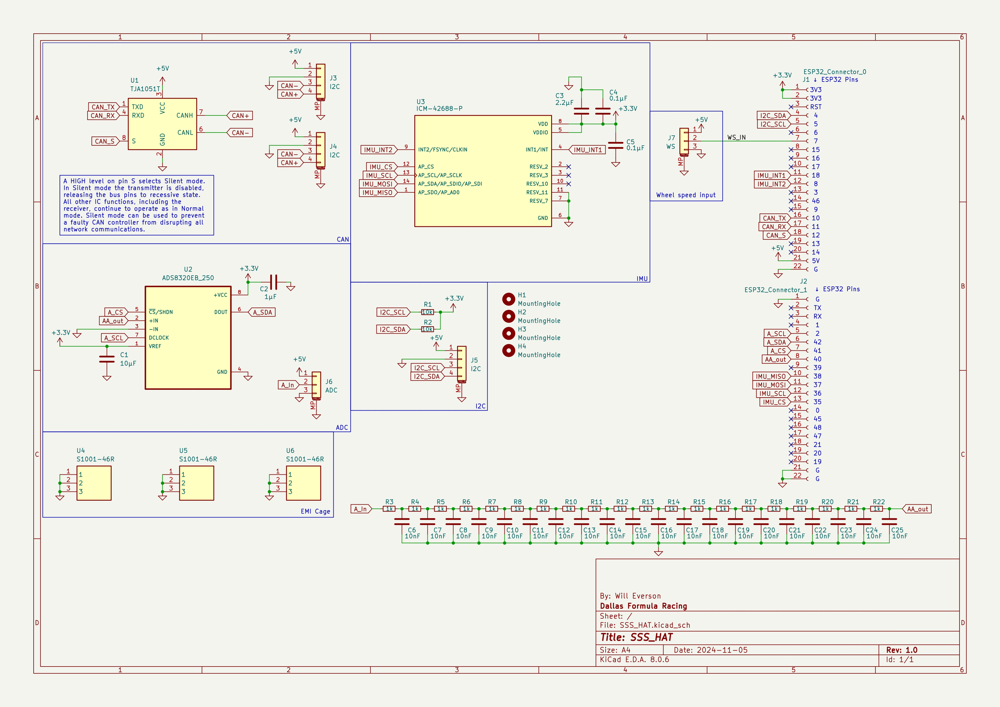
### PCB Drawing
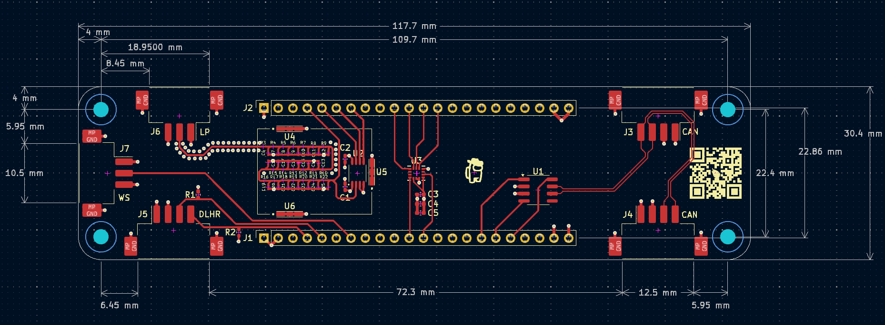
### PCB 3D Model
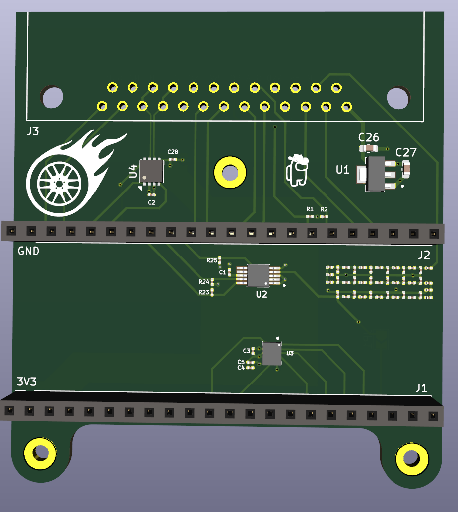
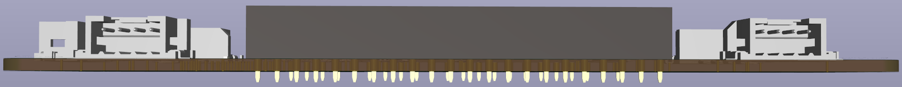
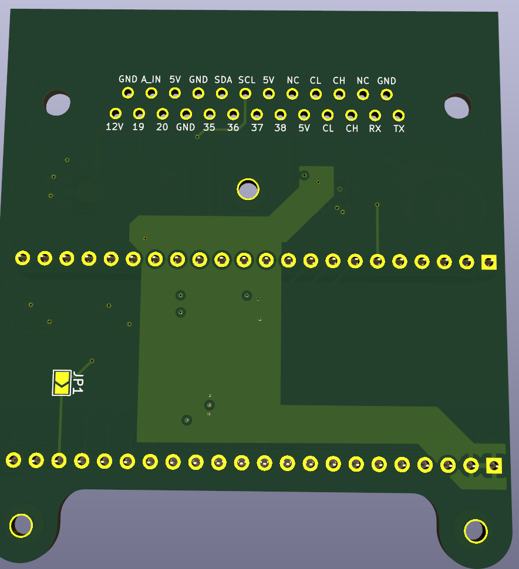
### Bill of Materials
|Part|Description|Photo|# of parts|Cost per part|Reference|
|:--|:--|:-:|--:|--:|--:|
|[TJA1051T](https://www.digikey.com/en/products/detail/nxp-usa-inc/TJA1051T-3-1J/5035822?utm_adgroup=General&utm_source=google&utm_medium=cpc&utm_campaign=PMax%20Shopping_Product_Zombie%20SKUs&utm_term=&utm_content=General&utm_id=go_cmp-17815035045_adg-_ad-__dev-c_ext-_prd-_sig-Cj0KCQiAoae5BhCNARIsADVLzZfN85grpeifPYBOIfQZmqBnjhDgX5-_qDHaBMGXU3fkYhMCIpdmNZ4aAuLQEALw_wcB&gad_source=1&gclid=Cj0KCQiAoae5BhCNARIsADVLzZfN85grpeifPYBOIfQZmqBnjhDgX5-_qDHaBMGXU3fkYhMCIpdmNZ4aAuLQEALw_wcB)|CAN transceiver||1|$1.22|U1|
|[ADS8320EB/250](https://www.digikey.com/en/products/detail/texas-instruments/ADS8320EB-250/275813)|External ADC|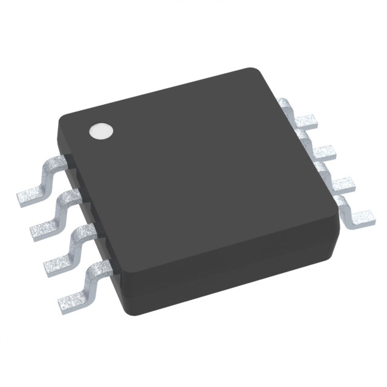|1|$14.68|U2|
|[ICM-42688-P](https://www.digikey.com/en/products/detail/tdk-invensense/ICM-42688-P/10824934)|6-DOF IMU|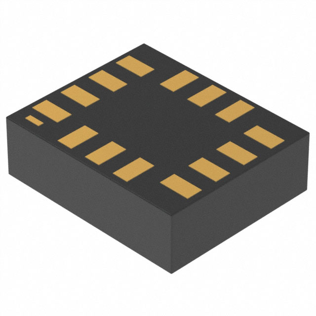|1|$0.74|U3|
|[1x22 2.54mm](https://www.ebay.com/itm/235072498164)|1x22 Single Row Female Straight Pin Header 2.54mm Pitch|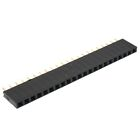|2|$0.49|J1-J2|
|[DF3D(Z)-3P-2H(51)](https://www.digikey.com/en/products/detail/hirose-electric-co-ltd/DF3EA-3P-2H(51)/6148621?utm_adgroup=General&utm_source=google&utm_medium=cpc&utm_campaign=PMax%20Shopping_Product_Zombie%20SKUs&utm_term=&utm_content=General&utm_id=go_cmp-17815035045_adg-_ad-__dev-c_ext-_prd-6148621_sig-Cj0KCQjw1Yy5BhD-ARIsAI0RbXbq7SBVNmAXCWU9K1fzl8auF7Nl_61zIEXugZVVEsHFKjp7xJIr2FsaAh0eEALw_wcB&gad_source=1&gclid=Cj0KCQjw1Yy5BhD-ARIsAI0RbXbq7SBVNmAXCWU9K1fzl8auF7Nl_61zIEXugZVVEsHFKjp7xJIr2FsaAh0eEALw_wcB)|3-pin connector|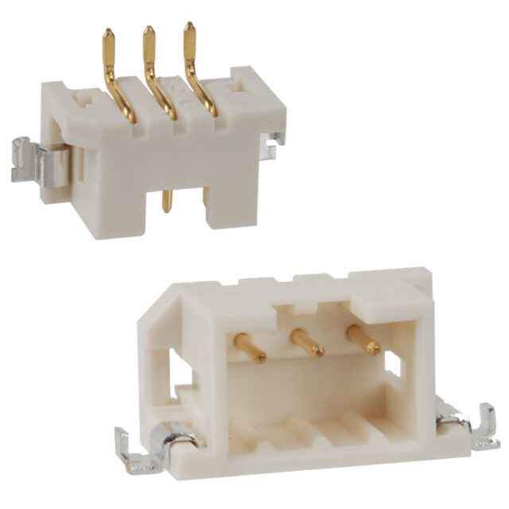|2|$0.95|J6-J7|
|[DF3D(Z)-3P-2H(51)](https://www.digikey.com/en/products/detail/hirose-electric-co-ltd/DF3EA-4P-2H-51/6148543?s=N4IgTCBcDaICIDEDMBRAggWgCwAUNgAkAKAVgEYBKEAXQF8g)|4-pin connector|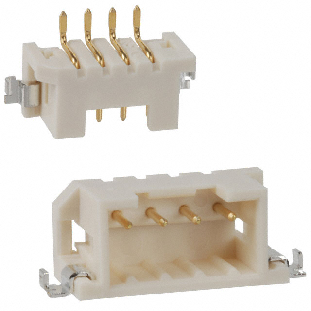|3|$1.08|J3-J5|
|[S02-20150300](https://www.mouser.com/ProductDetail/Harwin/S02-20150300?qs=rE7yDObIq0ygO5qZqrVEAg%3D%3D)| EMI shield | 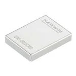|1|$4.26|
|[S1001-46R](https://www.mouser.com/ProductDetail/Harwin/S1001-46R?qs=HTI7V3DFux8iE7nFrNF%2Fww%3D%3D)| EMI shield connectors |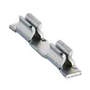|3|$0.58|U4-U6|
|10nF Capacitor|10nF 0201||20||C6-C25|
|0.1μF Capacitor|0.1μF 0402 Hand Solder||2||C4-C5|
|1μF Capacitor|1μF 0402 Hand Solder||1||C2|
|2.2μF Capacitor|2.2μF 0402 Hand Solder||1||C3|
|10μF Capacitor|10μF 0402 Hand Solder||1||C1|
|1kΩ Resistor|1kΩ 0201||20||R3-R22|
|10kΩ Resistor|10kΩ 0402||2||R1-R2|
